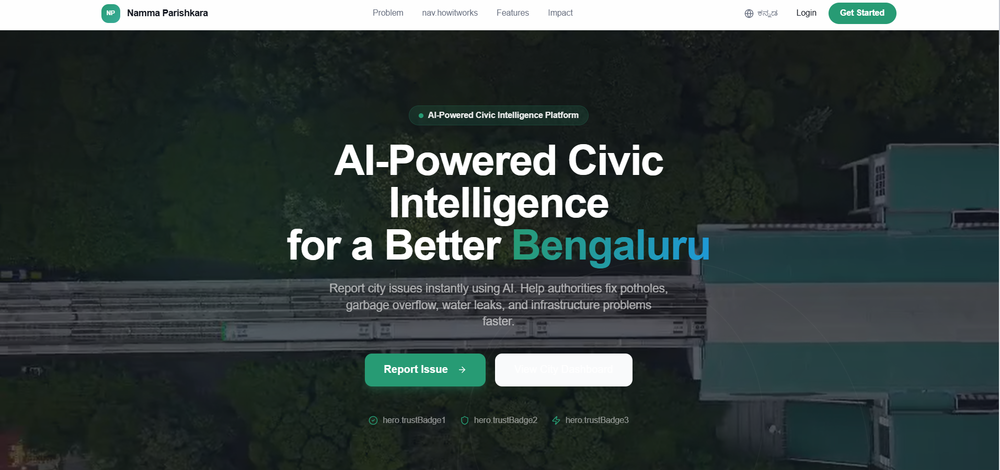
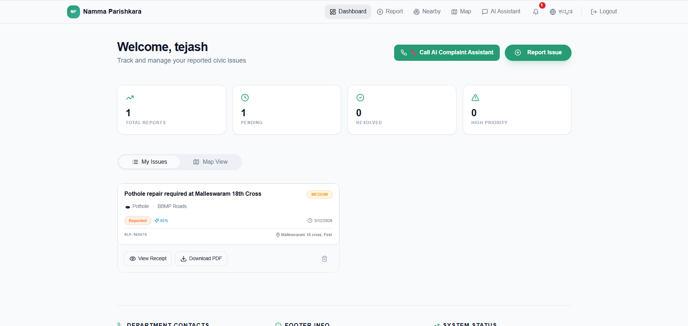
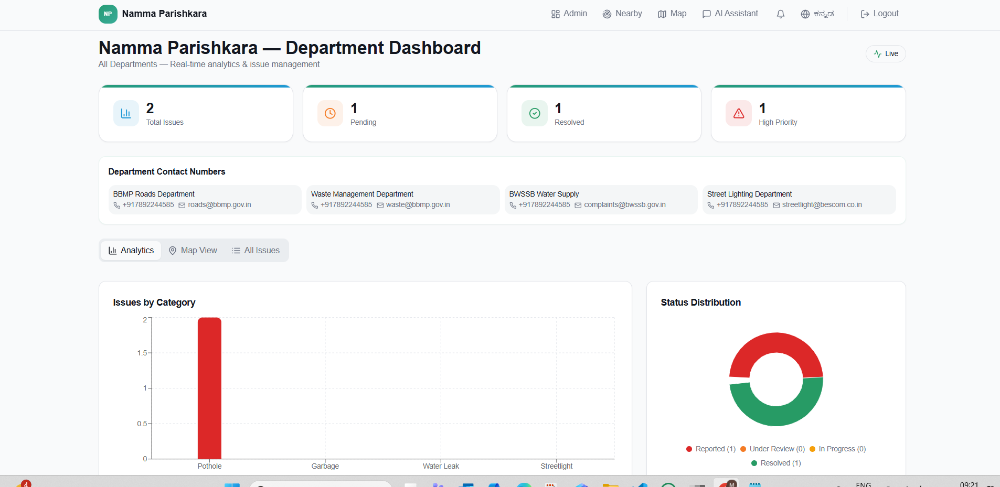
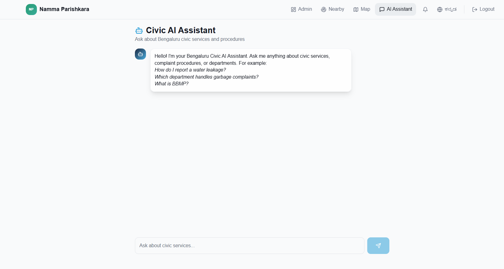

# 🚀 Namma Parishkara AI.

### Smart Civic Issue Detection & Complaint Automation Platform


---

# 🌍 Overview

**Namma Parishkara AI** is an intelligent civic infrastructure monitoring system that allows citizens to report city issues like:

* 🕳️ Pothole
* 🗑️ Garbage overflow
* 🌧 Drain blockage
* 💡 Streetlight failure
* 🚦 Traffic signal issues

The system uses **Artificial Intelligence, Computer Vision, and Retrieval-Augmented Generation (RAG)** to:

✔ Detect civic issues from images
✔ Analyze severity using AI
✔ Retrieve municipal policies
✔ Generate structured complaints automatically

The project demonstrates how **AI can improve Smart City governance.**

---

# 🧠 Core AI Technologies

| Technology      | Purpose                                 |
| --------------- | --------------------------------------- |
| RAG             | Knowledge retrieval from civic policies |
| NLP             | Understand citizen complaints           |
| YOLOv8          | Detect potholes from images             |
| Vector Database | Store policy embeddings                 |
| Local LLM       | Generate civic responses                |

The AI chatbot is powered using:

**Ollama**

---

# 🏗 System Architecture

```
Citizen
   │
   ▼
Frontend Web App
   │
   ▼
Backend API (Python)
   │
   ├── Image Detection (YOLOv8)
   │
   ├── RAG Engine
   │      │
   │      ├─ Civic Policy Docs
   │      └─ Vector Database
   │
   ▼
AI Complaint Generator
   │
   ▼
Municipal Department System
```

---

# 🤖 RAG Pipeline

The **Retrieval Augmented Generation system** allows the AI to answer civic questions using local policy documents.

```
User Question
     │
     ▼
Embedding Model
     │
     ▼
Vector Search
     │
     ▼
Retrieve Relevant Civic Policies
     │
     ▼
LLM Response Generation
     │
     ▼
Final AI Answer
```

Benefits:

✔ Accurate answers
✔ Uses municipal knowledge
✔ Works offline
✔ Prevents hallucinations

---

# 📸 Image Detection System

The platform detects potholes using a trained **YOLOv8 model**.

Detection Flow:

```
User Upload Image
      │
      ▼
Image Preprocessing
      │
      ▼
YOLOv8 Detection
      │
      ▼
Severity Analysis
      │
      ▼
Auto Complaint Generation
```

Example Output:

```
Detected Issue: Pothole
Severity: High
Department: Road Maintenance
Action: Repair within 24 hours
```

---

# 💻 Frontend Application

The frontend provides a modern civic portal for citizens.

Features:

✔ Landing Page
✔ User Login
✔ Admin Login
✔ Complaint Dashboard
✔ AI Chatbot Interface
✔ Image Upload System

Frontend stack:

* React
* Vite
* TailwindCSS
* Supabase integration

Project structure:

```
frontend/

public/
src/
supabase/

index.html
tailwind.config.ts
vite.config.ts
package.json
```

---

# ⚙ Backend System

The backend processes:

* AI inference
* Image detection
* RAG retrieval
* Complaint generation

Backend stack:

Python
Computer Vision
Vector Search

Project structure:

```
backend/

dataset/
docs/
images/
runs/

app.py
rag_model.py
pothole_detector.py
run_pipeline.py
dataset.yaml
generate_dataset.py
generate_docs.py
requirements.txt
```

---

# 📂 Full Project Structure

```
namma-parishkara-ai

frontend/
│
├── public/
├── src/
├── supabase/
├── index.html
├── package.json
└── vite.config.ts

backend/
│
├── dataset/
├── docs/
├── images/
├── runs/
├── app.py
├── rag_model.py
├── pothole_detector.py
├── run_pipeline.py
└── requirements.txt
```

---

# ⚙ Installation Guide

## 1️⃣ Clone the Repository

```
git clone https://github.com/yourusername/namma-parishkara-ai
cd namma-parishkara-ai
```

---

# Frontend Setup

Install dependencies

```
npm install
```

Run development server

```
npm run dev
```

---

# Backend Setup

Install Python dependencies

```
pip install -r requirements.txt
```

---

# Start Local AI Model

Install and run

**Ollama**

```
ollama pull mistral
ollama run mistral
```

---

# Run Backend

```
python app.py
```

---

# Train Pothole Detection Model

```
python generate_dataset.py
yolo detect train data=dataset.yaml model=yolov8n.pt epochs=50
```

---

# Example Workflow

Citizen uploads pothole image

↓

AI detects pothole severity

↓

RAG retrieves municipal policy

↓

Complaint automatically generated

↓

Admin dashboard tracks issue

---

# 🖼 Project Screenshots

Add screenshots here:

### Landing Page



### User Dashboard



### Admin Panel



### AI Chatbot



---

# 🚀 Future Improvements

* Mobile application
* Live CCTV monitoring
* GPS based complaint tagging
* Smart city IoT integration
* Predictive infrastructure repair

---

# 🏆 Hackathon Impact

This project demonstrates how **AI can modernize civic governance** by enabling:

* Automated infrastructure monitoring
* Faster complaint resolution
* AI-assisted municipal management
* Smart city analytics

---

# 👨‍💻 Author

Punith
Poornima V
Pihu Ojha
PunyaShree G

---

⭐ If you like this project, consider starring the repository!


